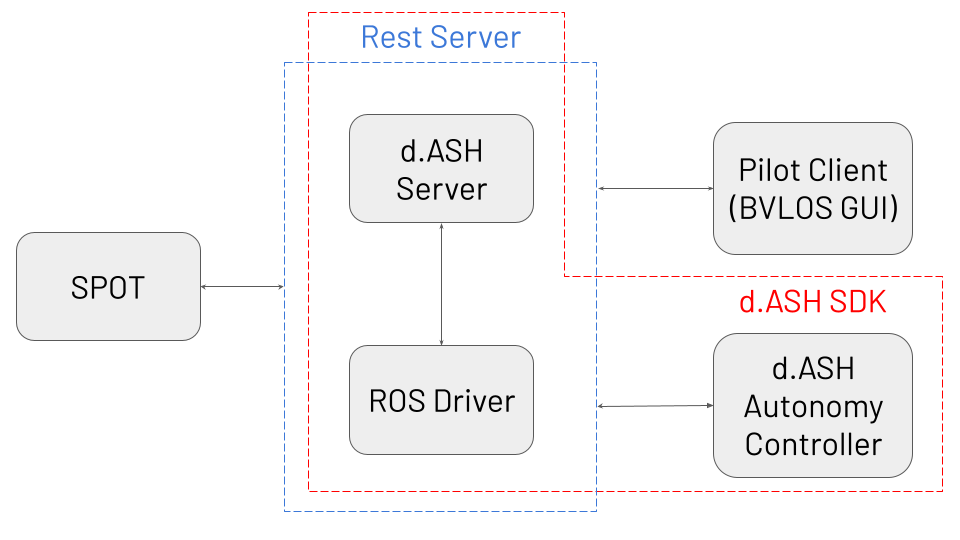

# dConstruct d.ASH SDK

The [dConstruct d.ASH SDK](https://www.dconstruct.co/services-1) is an SDK (software development kit) for autonomous robot navigation. Use the d.ASH SDK to develop applications for your own [Spot](https://www.bostondynamics.com/spot) from Boston Dynamics or any other robot you wish. This section of the d.ASH SDK documentation provides details about the components of the SDK.

## Autonomy Preparation
There are 3 main components encompassing the d.ASH SDK:

1. [d.ASH Server](#dash-server) 
2. [ROS Driver](#ros-driver) 
3. [d.ASH Autonomy Controller](#dash-autonomy-controller) 

{: style="width:500px" }

If you decide to use your own custom GUI in place of the [d.ASH Autonomy Controller](#dash-autonomy-controller), or you do not want to run autonomy, you will still need to implement the [d.ASH Server](#dash-server) and the [ROS Driver](#ros-driver) to operate your robot. 

### d.ASH Server
The d.ASH server acts as the main server responsible for sending control commands to the robot. At the same time, the d.ASH server also broadcasts secured data to any given remote systems.

### ROS Driver
The ROS driver is a [ROS node](http://wiki.ros.org/Nodes) that has autonomy functions onboard to make your robot accessible from ROS. The ROS driver handles computational calls from any client and sends control commands to the d.ASH server. In turn, the d.ASH server relays the autonomy commands to the robot for execution.

### d.ASH Autonomy Controller
The d.ASH Autonomy Controller is the GUI (graphical user interface) for the d.ASH SDK. It encompasses the interactive visual components for d.ASH's software and displays different elements for users to interact with to control your robot.

